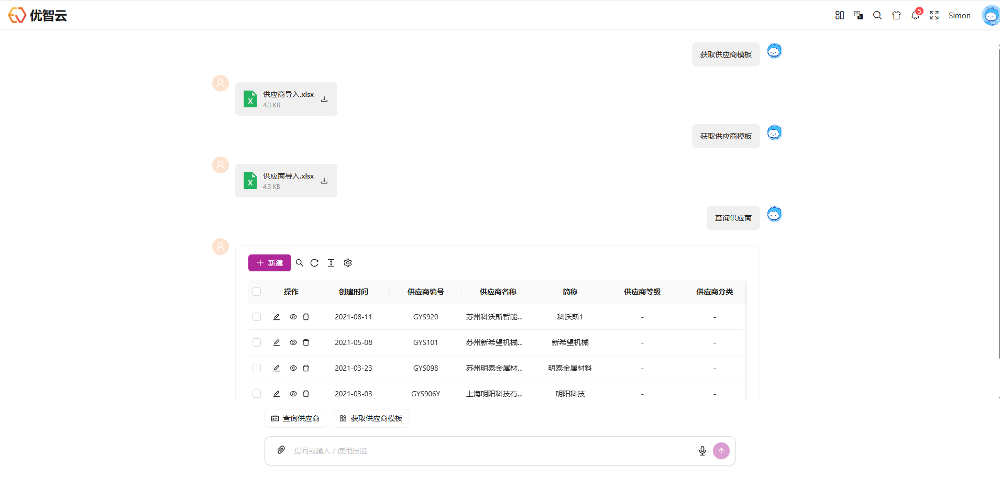
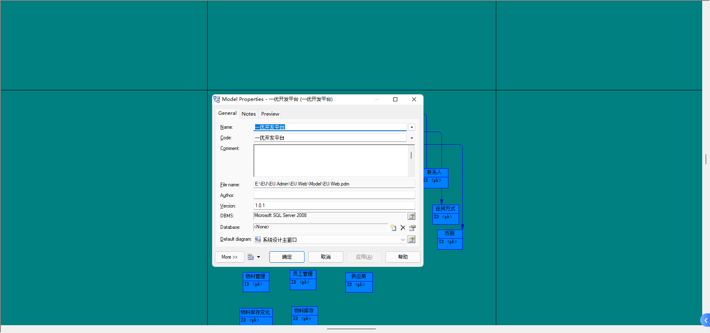
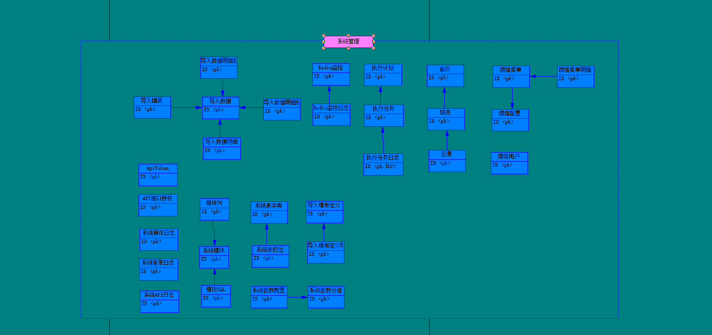
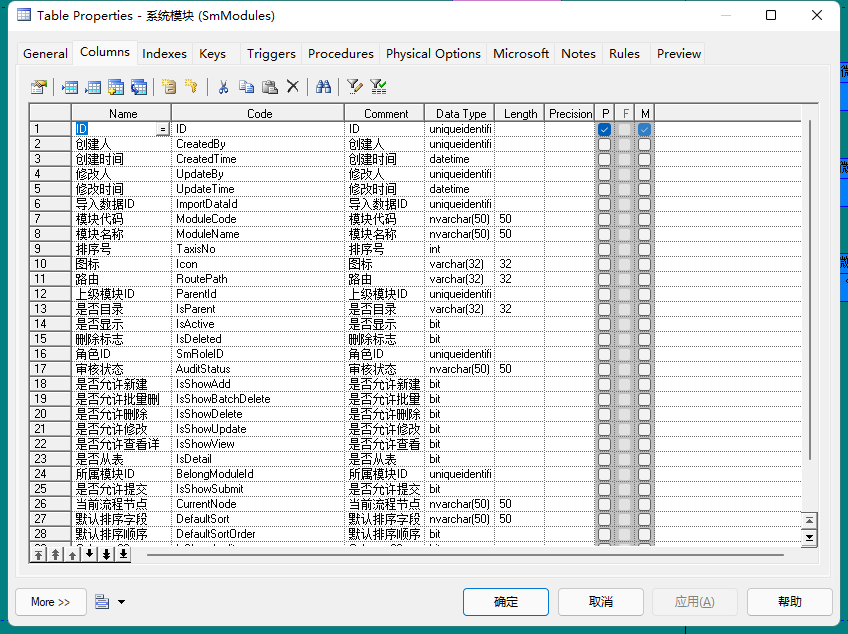

<div align="center">
  <h1>EU-Admin</h1>
  <h3>EU（一优） 一心一意 做好每件事</h3>

  [](LICENSE)
  [](https://dotnet.microsoft.com/)
  [](https://react.dev/)
  [](https://www.typescriptlang.org/)
  [](https://ant.design/)
</div>

## 📖 项目简介

🚀 **EU-Admin** 是一款开箱即用的企业级管理平台框架，采用前后端分离架构，致力于让业务开发变得简单高效。

**有合适工作机会给我推荐，base：苏州，谢谢谢谢！！！**

### 🎯 技术栈

**前端技术栈**
- **核心框架**: React 19 + TypeScript 5.7
- **构建工具**: Vite 7
- **UI 框架**: Ant Design 6 + Ant Design Pro Components
- **状态管理**: Redux Toolkit / Zustand
- **路由管理**: React Router v6
- **数据可视化**: ECharts + Ant Design Plots
- **实时通信**: SignalR
- **AI 集成**: Ant Design X (AI Chat 组件)

**后端技术栈**
- **核心框架**: .NET 10
- **ORM 框架**: SqlSugar + EF Core + Dapper
- **数据库支持**: SQL Server / MySQL / PostgreSQL / Oracle / SQLite / 达梦 / 人大金仓
- **认证授权**: JWT + Cookie Authentication
- **缓存方案**: Redis
- **任务调度**: Quartz.NET
- **消息队列**: RabbitMQ
- **AI 集成**: Microsoft.Extensions.AI + MCP (Model Context Protocol)
- **API 文档**: Swagger

## 🌟 在线体验

### 演示地址

#### 标准版
- 地址：http://8.136.42.224:60000/
- 账号：`Admin` 密码：`1`



### 相关项目

- 📱 **移动端**: [EU-Admin-ReactNative](https://github.com/xiaochanghai/eu.admin.reactnative)
- 🔧 **MCP 框架**: [MCPSharp - 基于 .NET Core 的 MCP 开发框架](https://github.com/xiaochanghai/MCPSharp)

## 🚀 快速开始

### 前置要求

- **前端**: Node.js >= 16.0.0
- **后端**: .NET 10 SDK
- **数据库**: SQL Server 2014+ / MySQL / PostgreSQL 等
- **缓存**: Redis（可选）

### 安装步骤

1. **克隆项目**
   ```bash
   git clone https://github.com/xiaochanghai/eu.admin
   cd eu-Admin
   ```

2. **配置数据库**
   - 下载数据库文件：[夸克网盘](https://pan.quark.cn/s/6076d8898646)
   - 使用 SQL Server 2014+ 导入数据库

3. **启动后端**
   ```bash
   cd eu.core
   dotnet restore
   dotnet run --project EU.Core.Api
   ```

4. **启动前端**
   ```bash
   cd eu.admin.react
   pnpm install
   pnpm dev
   ```

5. **访问应用**
   - 前端：http://localhost:9527
   - API：http://localhost:8015/swagger
   - 网关：http://localhost:9000
   - MCP API：http://localhost:8020/swagger

## ⚡ 核心功能

### 前端特性

- ✅ **现代化技术栈**: React 19 + TypeScript 5.7，全面拥抱 Hooks 和类型安全
- 🎨 **灵活主题系统**:
  - 支持亮色/暗黑模式切换
  - 主题颜色自定义、灰色模式、色弱模式
  - 紧凑主题、圆角大小可配置
  - Design Token 注入 CSS 变量
- 📐 **多布局支持**: 横向、经典（支持菜单分割）、纵向、分栏布局可随意切换
- 🔐 **权限管理**: 基于后端数据的动态路由生成，完整的菜单和路由权限控制
- 🏷️ **标签页管理**: 支持多标签页拖拽排序、详情页标签、页面缓存（Keepalive）
- 📊 **数据可视化**: ECharts 组件封装、数据大屏支持
- 🛠️ **开发体验**:
  - Vite 7 极速构建
  - ESLint + Prettier + Stylelint 代码规范
  - Husky + lint-staged + commitlint 提交规范
  - 支持 Gzip/Brotli 压缩、PWA、包分析等

### 后端特性

- 🏗️ **分层架构**: 采用 `仓储 + 服务 + 接口` 的标准分层设计
- ⚡ **异步优先**: 全面使用 async/await 异步编程
- 💾 **多数据库支持**:
  - 基于 SqlSugar，支持 MySQL/SQL Server/SQLite/Oracle/PostgreSQL/达梦/人大金仓
  - 支持主键类型配置化
  - 支持数据库分表、级联操作
  - DbFirst 一键生成四层文件
- 📝 **完善的日志**:
  - 五种日志类型：审计/异常/请求响应/服务操作/SQL 记录
  - 日志自动持久化到数据库
- 🎯 **AOP 切面**: 四种切面编程支持（日志、缓存、审计、事务）
- 🔒 **认证授权**:
  - 集成 Cookies、JWT 多终端认证
  - 基于策略（Policy）的授权机制
- 🔔 **实时通信**: SignalR 支持对指定用户通讯
- ⏰ **任务调度**: Quartz.NET 定时任务
- 🔄 **事件总线**:
  - 基于 Channel 的单机版发布订阅
  - 支持 Redis/RabbitMQ 分布式事件总线
- 📦 **对象映射**: AutoMapper 自动映射
- 🤖 **AI 集成**: 支持 OpenAI、MCP 协议
- 🎨 **灵活配置**:
  - 所有基础列表通过数据库脚本配置
  - 支持自定义导入导出
  - 动态权限菜单加载

## 🗄️ 数据库设计

项目采用 PowerDesigner 进行数据库结构设计，实现了完整的权限管理体系。

### 设计特点

- 📐 **规范化设计**: 基于 PowerDesigner 的专业数据库建模
- 🔐 **权限体系**: 用户 → 角色 → 模块（菜单）的权限关联设计
- 🔄 **多数据库支持**: 支持一键迁移至 MySQL 等多种数据库
- 📋 **完整文档**: 详细的数据库设计文件见 [model 目录](./model)

### 数据库架构图

<div align="center">







</div>

## 📦 部署指南

### 开发环境部署

**前端部署**
```bash
cd eu.admin.react
pnpm install
pnpm dev
```

**后端部署**
```bash
cd eu.core
dotnet restore
dotnet run --project EU.Core.Api
```

### 生产环境部署

- **前端**: Nginx 静态文件部署
- **后端**: IIS / Docker 容器化部署
- **容器化**: 详见 [Docker 部署文档](./doc/Docker部署.md)


## 📚 技术文档

### 核心技术文档

| 技术 | 官方文档 |
|------|---------|
| TypeScript | https://www.tslang.cn/docs/home.html |
| React | https://react.docschina.org/docs/getting-started.html |
| Ant Design | https://ant.design/components/overview-cn/ |
| Ant Design Pro | https://pro.ant.design/zh-CN/docs/overview |
| Ant Design Charts | https://charts.ant.design/zh |
| .NET | https://learn.microsoft.com/zh-cn/dotnet/ |
| EF Core | https://docs.microsoft.com/zh-cn/ef/core/ |
| SqlSugar | https://www.donet5.com/Home/Doc |

### 项目文档

- 📖 [使用手册](./doc/使用手册.md)
- 🐳 [Docker 部署](./doc/Docker部署.md)
- 🖥️ [初始化服务器](./doc/初始化服务器.md)
- 💻 [创建开发环境](./doc/创建开发环境.md)
- 🔧 [移除开发环境](./doc/移除开发环境.md)

## 🤝 参与贡献

### 贡献指南

欢迎所有形式的贡献！

1. Fork 本仓库
2. 创建特性分支 (`git checkout -b feature/AmazingFeature`)
3. 提交改动 (`git commit -m 'Add some AmazingFeature'`)
4. 推送到分支 (`git push origin feature/AmazingFeature`)
5. 提交 Pull Request

### Issue 提交

- 提 Issue 请到 [Github Issues](https://github.com/xiaochanghai/eu.admin/issues)
- Bug 反馈请包含：环境信息、复现步骤、预期结果、实际结果

## ❓ 常见问题

**Q: 为什么前端选择 React 而不是 Vue？**

A: 个人比较喜欢 React 的语法和 Ant Design React 版本的设计。Vue 也是很优秀的框架，后续可能会推出 Vue 版本。

**Q: 是否支持国产数据库？**

A: 支持，项目已集成达梦数据库和人大金仓数据库的支持。

**Q: 如何参与项目开发？**

A: 欢迎提交 PR，也可以通过邮件联系作者讨论功能需求。

## 📄 许可证

本项目基于 [MIT](./LICENSE) 许可证开源。

## 💌 联系方式

- 📧 **邮箱**: xiaochanghai@foxmail.com
- 🌐 **主页**: https://github.com/xiaochanghai/eu.admin
- 🐛 **Issues**: https://github.com/xiaochanghai/eu.admin/issues

## 🙏 鸣谢

- 苏州市创采软件有限公司 费鹏先生

---

<div align="center">

**与君共思共勉！欢迎 Star ⭐ 支持！**

Made with ❤️ by [xiaochanghai](https://github.com/xiaochanghai)

</div>